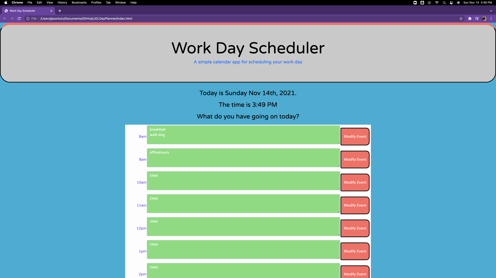

# Dynamic Day Planner Application

## Image of Application



## TASK

Create a simple calendar application that allows a user to save events for each hour of the day by modifying starter code. This app will run in the browser and feature dynamically updated HTML and CSS powered by jQuery.

## User Story

```md
AS AN employee with a busy schedule
I WANT to add important events to a daily planner
SO THAT I can manage my time effectively
```

# JDLDayPlanner

## Acceptance Criteria

```md
GIVEN I am using a daily planner to create a schedule

WHEN I open the planner
[x] THEN the current day is displayed at the top of the calendar

WHEN I scroll down
[x] THEN I am presented with timeblocks for standard business hours

WHEN I view the timeblocks for that day
[] THEN each timeblock is color coded to indicate whether it is in the past, present, or future

WHEN I click into a timeblock
[x] THEN I can enter an event

WHEN I click the save button for that timeblock
[x] THEN the text for that event is saved in local storage

WHEN I refresh the page
[x] THEN the saved events persist
```

## Review

```md
You are required to submit the following for review:

[x] The URL of the deployed application
[x] The URL of the GitHub repository, with a unique name and a README describing the project
```
